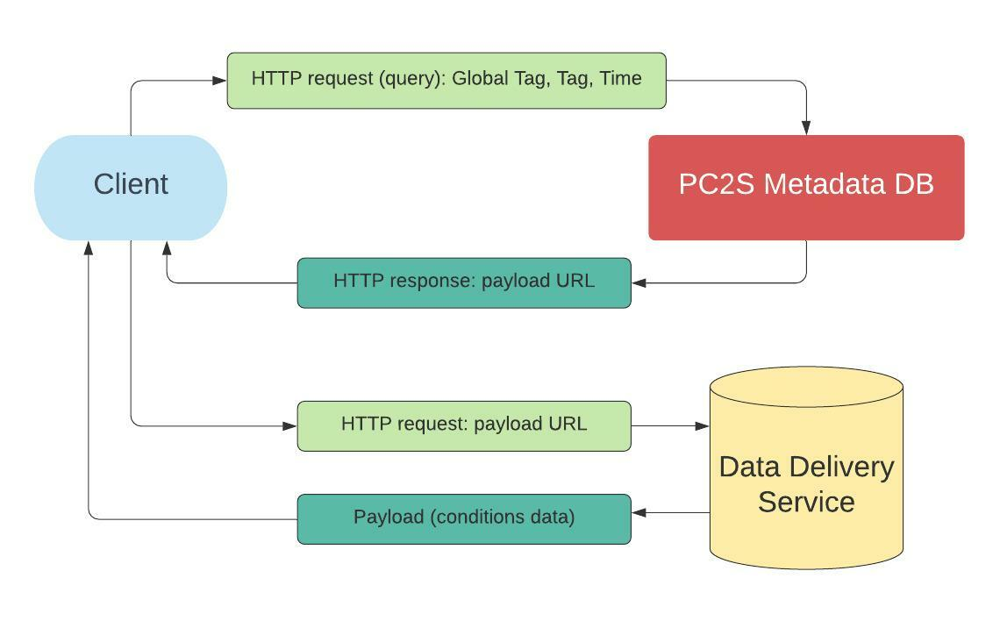

# PC2S: Portable Conditions and Calibrations Service

## The objective
The aim of the project is to realize a lightweight, fully portable, configurable,
experiment-agnostic service for the Conditons and Calibrations data.
It was inspired in part by the Belle II CDB and is based on recommendations
of the HEP Software Foundation, closely following the suggested data model.

## General Info

General information about the system can be found in the ```server/documentation```
folder in this repository:

* ```about.md``` - description of the system design
* ```clients.md``` - a digest of the CLI clients (Python-based)
* ```examples.md``` - examples of using the CLI clients to interact with the system

This content is also available from the pc2s-metadata service run as a container
(see below).

## Components

PC2S consists of two web services working in tandem, and
client software. The two web services are

* The PC2S Metadata server
* The Data Delivery service included as a simple nginx-based test server
in this repository. The nginx server can be easily configured for the needs
of the target experiment.

The role of the Metadata server is to locate the URLs of data payloads to
be delivered by the latter, based on queries from a client. Such queries
consist of the following parameters:

* The name of the specific data aggregation to be queried i.e. the *"Global Tag"*.
Examples of such aggregation would be a Global Tag used in production for a certain
run-year, or a set of parameters for some Monte Carlo campaign
* The name of the Tag, identifying the *type* of data to be retrieved. For example,
this could be data describing pedestals in a calorimeter, or a corresponding
dead channel map
* A timestamp - the time at which the data is considered valid

If there is a data product satisfying the query the service returns
a response in YAML format, containing the **URL of the payload**. The client
then can use this URL to access to the payload, to be retrieved from the data
delivery service. The workflow is illustrated in the diagram below:




At the moment the clients interfacing the two services described above are
implemented in two languages:

* Python: includes a reusable interface package and a few CLI utilities based on it.
* C++: a simple prototype application demonstrating access to the service using that platform.

Both are based on the *urllib* library and using the same identical interface
of the the PC2S Metadata server.

## Evaluation of the System using Docker

### Images

For a basic test of the funcionality of the system, the user needs to use
two Docker images, one for the PC2S Metadata service and its clients, and
another for the NGINX-based test instance of the data delivery service.

```bash
docker pull buddhasystem/pc2s-metadata:latest
docker pull buddhasystem/pc2s-nginx:latest
```

The *pc2s-metadata* image contains some mock metadata which will work
in conjunction with the content of the *pc2s-nginx* image. That means
that contents of a specific tag recorded in *pc2s-metadata* point
to valid files hosted on pc2s-nginx.

The *pc2s-metadata* image relies on the included sqlite database as the back end,
for most production scenarios a more robust delpoyment can be achieved
with Postgres, MariaDB or a similar solution. Likewise, the Web service
runs as the Django development server, and so an Apache instance will need
to be put in place in the production scenario.

The NGINX image contains some test data in ROOT and text formats that's useful
for for demonstration purposes. The content of these files is not relevant
for this test. The scope of the test is to run a PC2S client to get a proper payload
URL and then to optionally download the correct file from the delivery service (NGINX).

### Starting Services

Start a PC2S Metadata container exposing port 8000 to the host.
In this case mapping the internal 8000 to the host 8000 will do, provided
it's not used by some other service on your system. Other port numbers can
be used, too.

```bash
# Start a PC2S Metadata (Django) container, exposing port 8000 as 8000 on the host machine:
docker run --rm -d -p 8000:8000 buddhasystem/pc2s-metadata
```

To verify that the container is live, the user can now point the browser to
```localhost:8000```. The landing page will be shown, which contains links
to monitoring pages as well as documentation.

Now start the data delivery container:
```bash
# Start a PC2S Data Delivery (NGINX) container, exposing port 80 as 8080 on the host machine:
docker run -it --rm -d -p 8080:80 buddhasystem/pc2s-nginx
```

In this case, the container-internal port 80 is mapped to the host port 8080.
You can check that the ngnix service is live by pointing your browser to ```localhost:8080```
which should result in a basic landing page.

### Use Python-based CLI clients to interact with the Metadata Service

Determine the IDs of running PC2S containers, in a way similar to presented here:

```bash
$ docker ps -a
CONTAINER ID   IMAGE           COMMAND                  CREATED          STATUS          PORTS                                       NAMES
96c59bf2a088   pc2s-metadata   "python ../server/ma…"   16 seconds ago   Up 15 seconds   0.0.0.0:8000->8000/tcp, :::8000->8000/tcp   gifted_bhabha
6c06371c01bc   pc2s-nginx      "/docker-entrypoint.…"   21 hours ago     Up 21 hours     0.0.0.0:8080->80/tcp, :::8080->80/tcp       stoic_lamarr
```
In this case, *96c59bf2a088* is the ID of the metadata container which will be needed
to connect to it and run clients. Connect to the running PC2S Metadata container by running interactive shell (bash), e.g. by using ```docker exec -it XXX bash``` where "XXX" is the hash of the running container, which would be 96c59bf2a088 in the example above.
At the prompt, the user will have a ```bash`` session open in the "clients" directory,
which contains the following clients:

* ```gt.py``` - the Global Tag client
* ```gtm.py``` - the Global Tag Map client
* ```tag.py``` - the Tag client
* ```payload.py``` - the Payload client

All clients are equipped with the "help" function activated by the ```"-h"``` option.
Most of possible input errors will result in helpful error messages. For detailed
examples of interacting with the service, please see the "Examples" section of
the PC2S website which is now available to you as a container running at ```localhost:8000```.
If the container port 8000 is mapped to some other port number on the host
for whatver reason, the clients will require an additional command line argument
in the form ```-S 'http://localhost:XXXX/'``` to point to the correect URLs.

The simplest queries may look like this (actual output may vary):
```bash
# get a list of all global tags
$ ./gt.py -l
- name: gt_test
- name: gt_other
- name: sPHENIX2024

# get a list of all tags
$ ./tag.py -l
- tag_test_2
- tag_other
- EMCalDeadMap
- IHCalDeadMap
- SiPMtemp

# look at the content of a tag
$ ./tag.py -n IHCalDeadMap
name: IHCalDeadMap
until: 2024-12-24 22:50:50+00:00
globaltags:
- sPHENIX2024
payloads:
- name: ihcalmap1
  since: 2024-01-01 00:59:00+00:00
  url: http://localhost:8080/IHCalDeadMap/deadmap1.root
- name: ihcalmap2
  since: 2024-02-01 02:59:00+00:00
  url: http://localhost:8080/IHCalDeadMap/deadmap2.root
- name: ihcalmap3
  since: 2024-02-22 02:59:00+00:00
  url: http://localhost:8080/IHCalDeadMap/deadmap3.root
- name: ihcalmap4
  since: 2024-03-01 01:01:00+00:00
  url: http://localhost:8080/IHCalDeadMap/deadmap4.root
- name: ihcalmap5
  since: 2024-04-11 04:01:10+00:00
  url: http://localhost:8080/IHCalDeadMap/deadmap5.root
- name: ihcalmap6
  since: 2024-06-03 01:01:15+00:00
  url: http://localhost:8080/IHCalDeadMap/deadmap6.root

# locate a payload of a specific type, valid at the specified point in time
$ ./payload.py -f -g sPHENIX2024 -t IHCalDeadMap -T '2024-03-20 22:50:50+00:00'
name: ihcalmap4
tag: IHCalDeadMap
since: 2024-03-01 01:01:00+00:00
url: http://localhost:8080/IHCalDeadMap/deadmap4.root

```

The URL thus obtained can now be used to download the content using ```curl```, ```wget``
or any other suitable client.

The C++ client included in this repository for demo purposes can also be used.
It is not packaged in the image and should be compiled locally.

PC2S is using timezone-aware datetime. For that reason, all clients are expected
to provide timestamps etc in a format similar to this: ```'2024-06-07 02:01:14+00:00'```.

---
## Misc

### TZ-aware parsing of time in Django
Example:

```python
temp_date=parse_datetime("2026-07-21 22:50:50+00:00")
```

...which results in

```python
datetime.datetime(2026, 7, 21, 22, 50, 50, tzinfo=datetime.timezone(datetime.timedelta(0), '+0000'))
```
